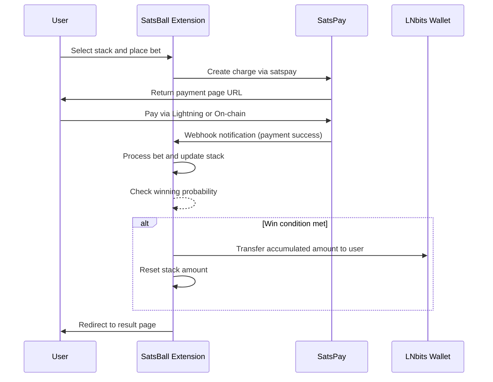

# LNbits Gambling Extension (SatsBall) Design Document

## 1. Overview

The SatsBall extension is a gambling application for LNbits that allows users to place bets using Bitcoin Lightning payments. The extension features multiple "stacks" where users can place bets. Each stack accumulates Bitcoin, and there's a probability-based mechanism for users to win all the Bitcoin in a stack. Administrators can configure the winning probability, bet price, and fee for each stack.

### Key Features:
- Multiple betting stacks with independent accumulations
- Probability-based winning mechanism
- Admin configuration for each stack (winning probability, bet price, fee)
- Integration with satspay for Bitcoin payments
- Winner takes all accumulated Bitcoin in a stack

## 2. Architecture

```
satsball/
├── __init__.py
├── manifest.json
├── migrations.py
├── views.py
├── views_api.py
├── templates/
│   └── satsball/
│       ├── index.html
│       ├── admin.html
│       └── payment.html
├── static/
│   └── satsball/
│       ├── style.css
│       └── script.js
└── crud.py
```

### Component Descriptions:
- `__init__.py`: Extension initialization
- `manifest.json`: Extension metadata and configuration
- `migrations.py`: Database schema definitions
- `views.py`: Web interface routes and handlers
- `views_api.py`: API endpoints for external integrations
- `templates/satsball/`: HTML templates for the user interface
- `static/satsball/`: CSS and JavaScript assets
- `crud.py`: Database operations (Create, Read, Update, Delete)

## 3. Data Models

### Stack
Represents a betting stack where users can place bets.

| Field | Type | Description |
|-------|------|-------------|
| id | string | Unique identifier for the stack |
| name | string | Display name of the stack |
| description | string | Description of the stack |
| current_amount | integer | Current accumulated amount in sats |
| bet_price | integer | Price per bet in sats |
| winning_probability | float | Probability of winning the stack (0.0-1.0) |
| fee_percentage | float | Fee percentage taken by the house (0.0-100.0) |
| enabled | boolean | Whether the stack is active for betting |
| created_at | timestamp | When the stack was created |

### Bet
Represents a user's bet on a specific stack.

| Field | Type | Description |
|-------|------|-------------|
| id | string | Unique identifier for the bet |
| stack_id | string | Reference to the stack |
| payment_hash | string | LNbits payment hash |
| amount | integer | Bet amount in sats |
| user_id | string | Identifier for the user (optional) |
| created_at | timestamp | When the bet was placed |
| is_winner | boolean | Whether this bet won the stack |

### WinHistory
Records when a user wins a stack.

| Field | Type | Description |
|-------|------|-------------|
| id | string | Unique identifier for the win |
| stack_id | string | Reference to the stack |
| bet_id | string | Reference to the winning bet |
| amount_won | integer | Amount won in sats |
| user_id | string | Identifier for the user (optional) |
| timestamp | timestamp | When the win occurred |

## 4. API Endpoints

### Public Endpoints
- `GET /api/v1/stacks` - List all available stacks
- `GET /api/v1/stacks/{stack_id}` - Get details of a specific stack
- `POST /api/v1/stacks/{stack_id}/bet` - Place a bet on a stack
- `GET /api/v1/bets/{bet_id}` - Check the status of a bet

### Admin Endpoints
- `GET /api/v1/admin/stacks` - List all stacks (admin view)
- `POST /api/v1/admin/stacks` - Create a new stack
- `PUT /api/v1/admin/stacks/{stack_id}` - Update stack configuration
- `DELETE /api/v1/admin/stacks/{stack_id}` - Delete a stack
- `GET /api/v1/admin/stacks/{stack_id}/history` - View win history for a stack

## 5. Payment Flow



## 6. Business Logic

### Bet Placement Process
1. User selects a stack and initiates a bet
2. System creates a payment request via satspay extension
3. User completes payment through Lightning Network or on-chain
4. On payment confirmation:
   - Bet amount is added to the stack's current amount
   - Fee is deducted and sent to admin wallet
   - Winning probability is evaluated
   - If win condition is met:
     - All accumulated amount in stack is transferred to user
     - Stack amount is reset to zero
   - Bet record is stored in database

### Probability Calculation
Each time a bet is placed, the system generates a random number between 0 and 1. If this number is less than or equal to the stack's winning probability, the bet wins.

### Fee Management
Fees are calculated as a percentage of each bet and are immediately transferred to an admin wallet. The remaining amount goes to the stack.

## 7. Admin Configuration

Administrators can configure each stack with the following parameters:
- **Name**: Display name for the stack
- **Description**: Detailed description of the stack
- **Bet Price**: Fixed price for each bet in sats
- **Winning Probability**: Chance of winning the stack (0.0-1.0)
- **Fee Percentage**: Percentage of each bet taken as fee (0.0-100.0)
- **Enabled**: Whether the stack is available for betting

## 8. User Interface

### Public Pages
1. **Main Page**: Displays all available stacks with their current amounts, bet prices, and winning probabilities
2. **Payment Page**: Generated by satspay for completing payments
3. **Result Page**: Shows whether the user won or lost, and current stack status

### Admin Pages
1. **Dashboard**: Overview of all stacks and recent activity
2. **Stack Management**: Create, edit, and delete stacks
3. **History**: View win history and statistics

## 9. Security Considerations

- All API endpoints must validate permissions appropriately
- Payment webhooks must be verified to prevent tampering
- Random number generation for probability calculations must be cryptographically secure
- Proper input validation on all user-submitted data
- Protection against race conditions in stack amount updates

## 10. Testing Strategy

### Unit Tests
- Probability calculation functions
- Fee calculation logic
- Database operations (CRUD)
- API endpoint validation

### Integration Tests
- Payment flow with satspay
- Stack creation and management
- Win condition processing
- Admin authorization

### Manual Testing
- User interface responsiveness
- Payment page rendering
- Result page accuracy
- Admin configuration options